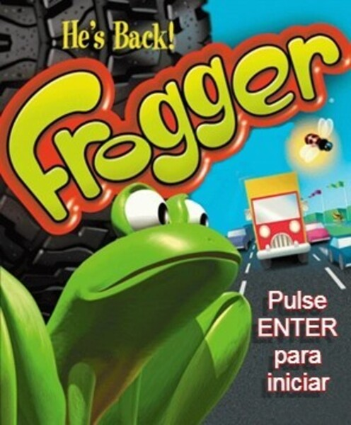
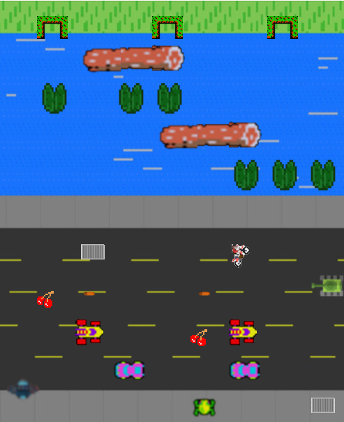

# Frogger

## Equipo de desarrollo

- Florencia
- Lucio
- Nicolas
- Elias

## Capturas

## Reglas de Juego / Instrucciones

Hay que llevar a frogger una vez a cada meta para ganar el juego. Inicialmente se tiene 3 vidas, pero consumiendo frutas que otorgan 25 puntos cada una y llegando a 100 puntos se suma una nueva.
Se deben esquivar los obstaculos sorteados por el mapa, y en la tecer llegada a estos se sumara el ovni que te perseguira.

MOVIMIENTO:
Movimiento con las flechitas
Supersalto con SPACE

PUNTUACION:
Consultar puntuacion y vidas con V

MUSICA:
Subir volumen con W
Bajar volumen con S
Parar musica con M

## Otros

- Programacion con objetos 1 - UNQUI
- Versión de wollok 3.0.0
- Una vez terminado, no tenemos problemas en que el repositorio sea público
